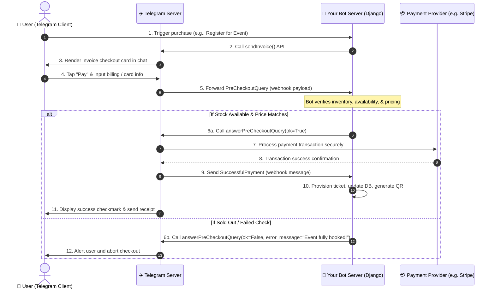

# 💳 Telegram Payments Integration Guide
A comprehensive technical and practical guide to integrating native payments in Telegram Bots and Mini Apps.

---

## 🌟 Executive Summary
Telegram Payments allow bots to sell goods and services directly within the chat or via Telegram Mini Apps. Instead of building complex payment forms and handling PCI-DSS compliance, you use Telegram's unified checkout sheet, which handles credit cards, Apple Pay, Google Pay, and **Telegram Stars** natively.

> [!NOTE]
> Telegram **does not store card details or process payments directly** (except for Telegram Stars). It acts as a secure intermediary between your Bot, the User's client app, and the Payment Provider (e.g., Stripe).

---

## 🔄 Technical Architecture: The 3-Way Handshake
Telegram uses a strict validation handshake to guarantee transaction integrity. Here is the step-by-step payment flow:



---

## ⚡ Fiat Payments vs. Telegram Stars (XTR)
Telegram supports two main paradigms depending on what you are selling:

| Feature | 💵 Fiat Payment (Stripe, etc.) | 🌟 Telegram Stars (XTR) |
| :--- | :--- | :--- |
| **Primary Use Case** | Physical goods, offline tickets, real-world services. | Digital items, premium features, virtual event content. |
| **App Store Compliance** | Exempt from Apple/Google 30% cut. | **Mandatory** for digital goods inside iOS/Android apps. |
| **Payment Provider** | Connected via `@BotFather` (Stripe, Payme, etc.). | Managed by Apple, Google, or Telegram Premium Bot. |
| **Developer Payout** | Direct to your bank account (via Stripe/Provider). | Converted to Toncoins (TON) on Fragment or spent on Ads. |
| **API Parameter** | `provider_token` = `STRIPE_API_TOKEN` | `provider_token` = `""` (Empty string)<br>`currency` = `"XTR"` |

---

## 🛠️ API reference & Key Parameters

### 1. `sendInvoice`
Sends a payment invoice card to a specific chat.
- **`chat_id`**: Target user identifier.
- **`title`**: Product title (max 32 chars).
- **`description`**: Product description (max 255 chars).
- **`payload`**: Internal developer data (e.g., unique order ID or registration UUID) that will return in webhooks. **Never show this to users**.
- **`provider_token`**: Token from `@BotFather`. Use `""` for Telegram Stars.
- **`currency`**: Three-letter ISO 4217 currency code (e.g. `"USD"`, `"EUR"`) or `"XTR"` for Stars.
- **`prices`**: Array of `LabeledPrice` objects: `[{"label": "General Admission", "amount": 1000}]` (Amount is in lowest currency units, e.g., 1000 = $10.00).

---

## 💻 Django Integration Code (Implementation)

Here is how you implement this payment flow inside a Django application, built in a modular style matching your project structure:

### 1. Send the Invoice
Add this utility to `backend/apps/notifications/telegram_utils.py` to trigger the invoice rendering:

```python
import requests
from django.conf import settings
import logging

logger = logging.getLogger(__name__)

def send_payment_invoice(chat_id, title, description, payload, price_amount, currency="USD"):
    """
    Sends a native checkout invoice card to a Telegram user.
    """
    token = getattr(settings, 'TELEGRAM_BOT_TOKEN', '')
    provider_token = getattr(settings, 'TELEGRAM_PROVIDER_TOKEN', '') # Blank for Telegram Stars
    
    url = f"https://api.telegram.org/bot{token}/sendInvoice"
    
    # 1. format the pricing (Stripe/Telegram processes in cents)
    amount_in_cents = int(price_amount * 100) if currency != "XTR" else int(price_amount)
    prices = [
        {"label": "Event Registration Fee", "amount": amount_in_cents}
    ]
    
    payload = {
        "chat_id": chat_id,
        "title": title,
        "description": description,
        "payload": str(payload), # Convert model UUID to string
        "provider_token": provider_token,
        "currency": currency,
        "prices": prices,
        "start_parameter": f"pay-reg-{payload}",
        "need_name": True,
        "need_email": True,
        "send_email_to_provider": True # Let Stripe handle email receipts
    }
    
    try:
        response = requests.post(url, json=payload, timeout=10)
        response.raise_for_status()
        return response.json().get("ok", False)
    except Exception as e:
        logger.error(f"Failed to send Telegram invoice: {e}")
        return False
```

### 2. Handle the Webhook Processing
Extend your webhook handler in `backend/apps/notifications/views.py` to process pre-check validations and final payments:

```python
from rest_framework.views import APIView
from rest_framework.response import Response
from rest_framework import status
from rest_framework.permissions import AllowAny
import requests
import logging
from django.conf import settings
from apps.events.models import EventRegistration

logger = logging.getLogger(__name__)

class TelegramWebhookView(APIView):
    permission_classes = [AllowAny]

    def post(self, request):
        data = request.data
        
        # ──────────────────────────────────────────────────────────
        # PHASE 1: Handle PRE-CHECKOUT verification query (10s Timeout)
        # ──────────────────────────────────────────────────────────
        if "pre_checkout_query" in data:
            query = data["pre_checkout_query"]
            query_id = query["id"]
            reg_id = query["invoice_payload"] # Extracted from the invoice payload we sent
            
            # Validate order availability
            is_valid = True
            error_message = ""
            
            try:
                registration = EventRegistration.objects.get(id=reg_id)
                # Check if event has space or registration is expired
                if registration.event.is_fully_booked():
                    is_valid = False
                    error_message = "Sorry, this event is already fully booked."
                elif registration.payment_status == 'verified':
                    is_valid = False
                    error_message = "You have already paid for this event registration!"
            except EventRegistration.DoesNotExist:
                is_valid = False
                error_message = "Registration record not found or has expired."
                
            # Submit verification response back to Telegram immediately
            success = self.answer_pre_checkout(query_id, ok=is_valid, error_message=error_message)
            return Response({"status": "ok" if success else "failed"})

        # ──────────────────────────────────────────────────────────
        # PHASE 2: Handle SUCCESSFUL PAYMENT confirmation
        # ──────────────────────────────────────────────────────────
        elif "message" in data and "successful_payment" in data["message"]:
            message = data["message"]
            chat_id = message["chat"]["id"]
            payment = message["successful_payment"]
            reg_id = payment["invoice_payload"]
            
            # Extract transactional IDs
            tg_charge_id = payment["telegram_payment_charge_id"]
            provider_charge_id = payment.get("provider_payment_charge_id", "STARS_TRANSACTION")
            
            try:
                registration = EventRegistration.objects.get(id=reg_id)
                
                # Mark as verified and confirm ticket booking
                registration.payment_status = 'verified'
                registration.status = 'confirmed'
                registration.metadata.update({
                    "telegram_charge_id": tg_charge_id,
                    "provider_charge_id": provider_charge_id
                })
                registration.save()
                
                # Generate attendance QR Code
                registration.generate_qr_code()
                
                # Notify Student with confirmation
                from apps.notifications.telegram_utils import send_telegram_message
                send_telegram_message(
                    chat_id=chat_id,
                    text=(
                        f"🎉 <b>Payment Successful!</b>\n\n"
                        f"Your ticket for <b>{registration.event.title}</b> is confirmed.\n"
                        f"💳 Charge ID: <code>{provider_charge_id}</code>\n\n"
                        f"Your QR code has been sent. Have a great event! 🎟️"
                    )
                )
            except EventRegistration.DoesNotExist:
                logger.error(f"Payment received for non-existent registration ID: {reg_id}")
                
            return Response({"status": "ok"})
            
        return Response({"status": "ignored"})

    def answer_pre_checkout(self, query_id, ok, error_message=""):
        """Sends validation approval or rejection response to Telegram"""
        token = getattr(settings, 'TELEGRAM_BOT_TOKEN', '')
        url = f"https://api.telegram.org/bot{token}/answerPreCheckoutQuery"
        
        payload = {
            "pre_checkout_query_id": query_id,
            "ok": ok
        }
        if not ok:
            payload["error_message"] = error_message
            
        try:
            res = requests.post(url, json=payload, timeout=8)
            return res.json().get("ok", False)
        except Exception as e:
            logger.error(f"Error answering pre-checkout: {e}")
            return False
```

---

## 🔒 Security Best Practices
1. **Webhook Secrets**: Always set up a `secret_token` when registering webhooks (`setWebhook(url, secret_token="your_secret")`). Telegram will supply this in the header `X-Telegram-Bot-Api-Secret-Token` for every request. Verify this header in your Django view!
2. **Double-Verify Payload**: Ensure the payload variable holds a database key/UUID that matches a pending record. Do not trust user inputs or price figures on the callback; verify them against your own database.
3. **Idempotency**: Block double payments. If a user tries to trigger `PreCheckoutQuery` for a record that has already been flagged as paid or has a processing lock, return `ok=False`.
